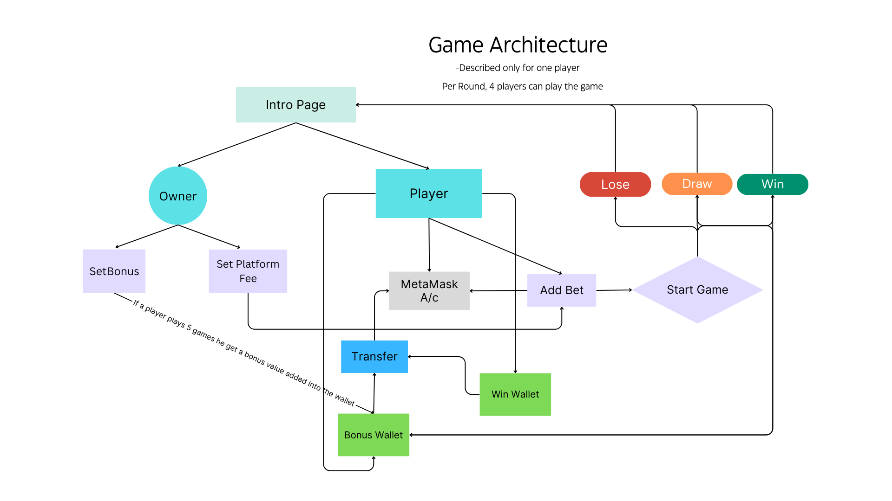

<h1 align="center">Three Card Poker</h1>
<h3 align="center">A Blockchain Smart Contract based game </h3>
<h3 align="center">The goal of this project is to create a game tailored for poker players to play using their metamask account</h3>
<h4 align="center">You can visit my website at <a href="https://threecardpoker.vercel.app/" target="blank">https://threecardpoker.vercel.app/</a> </h3>

<h2 align="left">Tech Stack and Tools :</h2>
<p>
<a href="https://soliditylang.org/" target="_blank" rel="noreferrer">  </a>
<a href="https://docs.ethers.org/v5/" target="_blank" rel="noreferrer">  </a>
<a href="https://hardhat.org/" target="_blank" rel="noreferrer">  </a>
<a href="https://reactjs.org/" target="_blank" rel="noreferrer">  </a>
<a href="https://tailwindcss.com/" target="_blank" rel="noreferrer">  </a>
<a href="https://vercel.com" target="_blank" rel="noreferrer">  </a>
<a href="https://metamask.io/" target="_blank" rel="noreferrer">  </a>
<a href="https://sepolia.etherscan.io/" target="_blank" rel="noreferrer">  </a>
</p>

<h2 align="left">Game Architecture </h2>


<h2 align="left">Features and Uniqueness</h2>

- MetaMask Integration  

- Platform Fee 
  
- Player Fee 

- Bonus 

- Separate Dashboards for Players and Owners 

<h2 align="left">Uniqueness</h2>

- The winning algorithm is quite simple and different from existing ones.

- Separate dashboards are created for both players and owners.

- A bonus is awarded to players for every 5 games played, enhancing the gaming experience.

- Each round accommodates 4 players, ensuring smooth gameplay without interruptions from others not engaged in the game.

- The current setup may not be highly scalable, but improvements can be made by adjusting the smart contract.

- The user interface is aesthetically pleasing, enhancing the overall gaming experience.

<h2 align="left">Game (Video)</h2>


https://github.com/user-attachments/assets/49a7315d-a6de-4abf-98f2-c74f4e04ff90


<h2 align="left">Installation</h2>
To get started with this project, clone the repository and install the necessary libraries in your system

```bash
# Clone the repository
git clone https://github.com/Rupesh2728/Three-Card-Poker.git

# Navigate to the project directory
cd Three-Card-Poker-main

# Install all the Hardhat related packages
npm install

# Install all the Client related packages
cd client
npm install
```
- Project is ready for execution !!!
  
- You can also visit my website at the deployed URL <a href="https://threecardpoker.vercel.app/" target="blank">https://threecardpoker.vercel.app/</a>

<h2 align="left">Images</h2>
<a href="" target="_blank" rel="noreferrer"> 
 
</a>

<a href="" target="_blank" rel="noreferrer"> 
 
</a>

<a href="" target="_blank" rel="noreferrer"> 
 
</a>

<a href="" target="_blank" rel="noreferrer"> 
 
</a>

<a href="" target="_blank" rel="noreferrer"> 
 
</a>

<h2 align="left">Contact Me</h2>

- 📫 You can to reach me by mailing to **rupesh.p21@iiits.in** or **rupeshprofessional2728@gmail.com**

- 👨‍💻 Project is available at [https://github.com/Rupesh2728/Three-Card-Poker.git]
  


